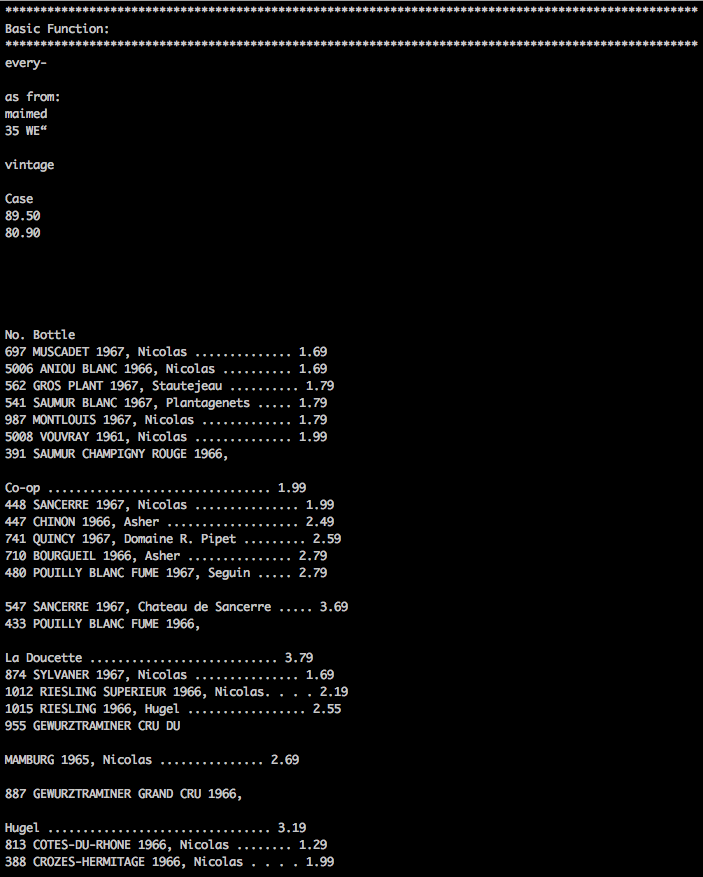
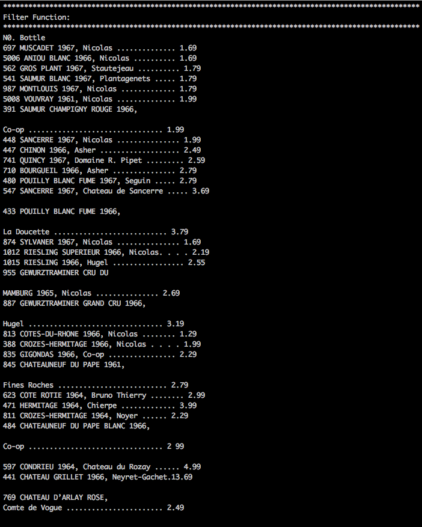
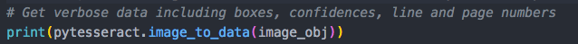

# Optical Character Recognition: Converting wine catalouge images to text

## OCR using Pytesseract

## Dependencies:

    1.) Pytesseract
    2.) Matplotlib
    3.) Numpy
    4.) openCV

## Key features of the ocr-python.py script:

1. Executable Python script that is **highly resuable** - just add a for-loop to itterate the execution of tesseract on up to as many images as want.

2. Multi-layered filtering- just execute the ocr-python.py script to run multiple filters through images to imporve accuracy of tesseract OCR recognition

Basic Function Filter:

Images Adjusting Filter:

3. Uses matplotlib to allow you to visualize how your filtering functions are actually manipulating images- display is based on a timer that you can control

4. Display the hOCR data by uncommenting this command for each filter

The hOCR data output will look like this:

### Next Steps:

1. Enhance image quality
2. Automate rotattion of image
3. Deskewing / Border Removal
4. Cancel noise
5. Logical operation to output the text with the highest confidence
6. Incorporate data training and testing
