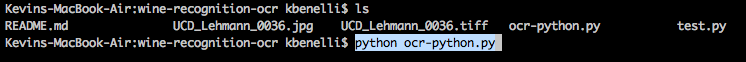
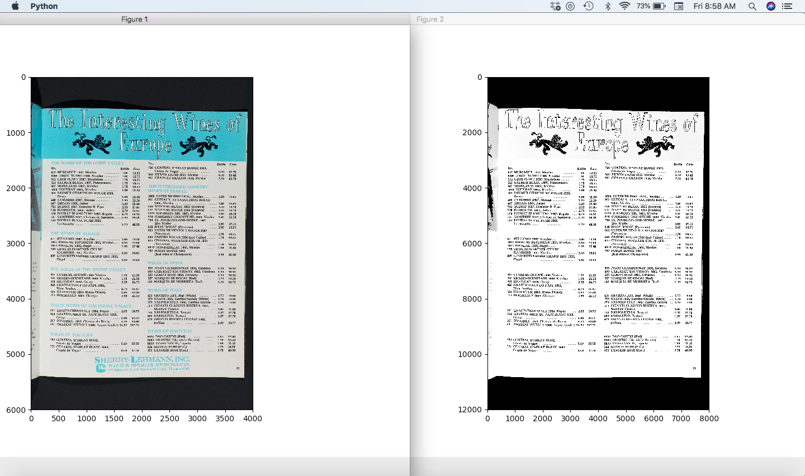
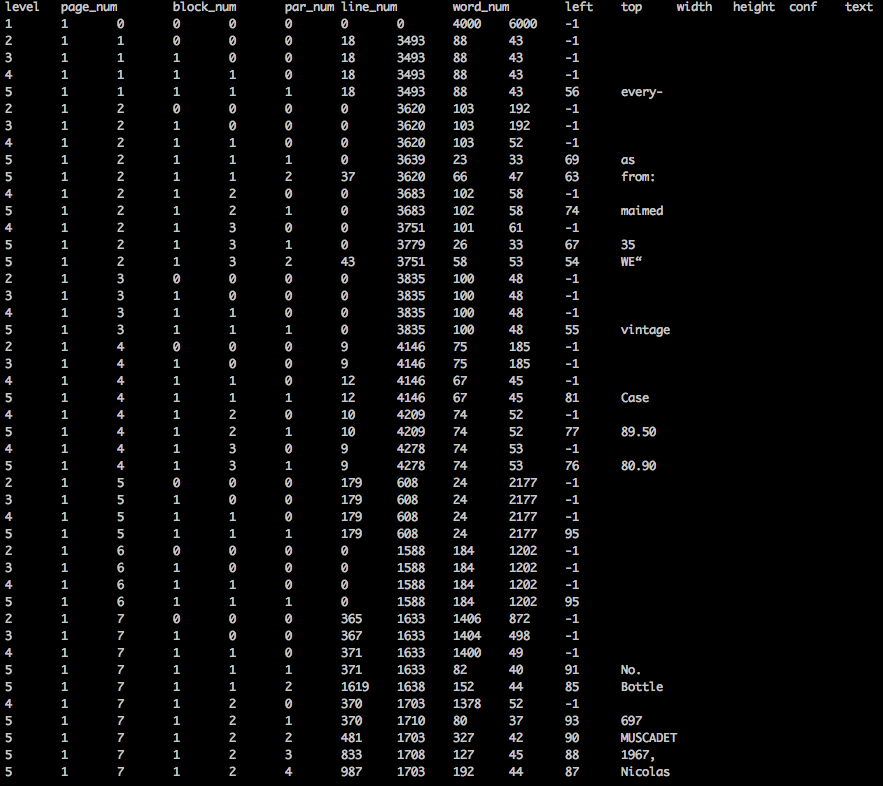

# Optical Character Recognition: Converting wine catalouge images to text

## OCR using Pytesseract

## Dependencies:

    1.) Pytesseract
    2.) Matplotlib
    3.) Numpy
    4.) openCV

## Key features of the ocr-python.py script:

1. Executable Python script that is **highly resuable** - just add a for loop to itterate through as many images as you have

2. Uses matplotlib to allow you to visualize how your filtering functions are actually manipulating images- display is based on a timer that you can control

3. Displays hocr data

### Next Steps:

Cancel noise

1. Enhance image quality

2. Automate rotattion of image

3. Deskewing / Border Removal

4. Logical operation to output the text with the highest confidence

5. Incorporate data training and testing
